# ANSIBLE CONFIGURATION MANAGEMENT

The purpose of this project is to develop Ansible scripts to simulate the use of a Jump box/Bastion host to access our Web Servers.

### INSTALL AND CONFIGURE ANSIBLE ON EC2 INSTANCE

- Updated the Name tag on Jenkins EC2 Instance to Jenkins-Ansible. This server will be used to run playbooks.

- Created a new repository from my github account and named it ansible-config-mgt.

- Installed Ansilble

```
sudo apt update

sudo apt install ansible
```

- Verified the version of ansible installed by running the command ansible --version

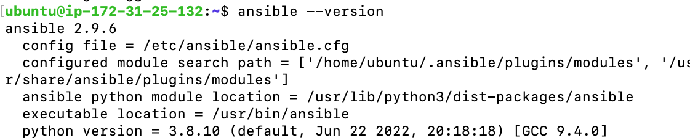

- Configured Jenkins build job to save the repository content everytime a change is made.

- Created a new freestyle project "ansible" in Jenkins and pointed it to the "ansible-config" repository.

- Configured Webhook in Github and set webhook to trigger ansible build.

- Tested the setup by making some change in README.MD file in main branch and ensure the build started automatically and Jenkins saved the file. 

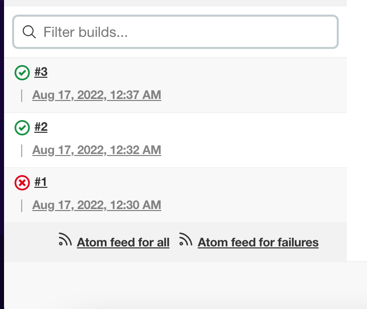

### Preparing development environment using Visual Studio Code

- configured VSC to connect to the newly created github repository 

- Created a folder and named it ansible and cd into it.
```
mkdir ansible && cd ansible
```
- Cloned the ansible-config repository in the ansible folder
``` 
git clone https://github.com/Revelation69/ansible-config-mgt.git
```

### ANSIBLE DEVELOPMENT

- Cd into the ansible-config folder and created a new branch. 

```
git checkout -b feature/project-11-setup
```
- and switched to it.

-  In the playbooks folder, created the first playbook named it common.yml 

```
touch common.yml
```

- and in the inventory folder, created an inventory file (.yml) for each environment (Development, Staging Testing and Production) respectively 
```
touch dev.yml staging.yml uat.yml prod.yml
```

- Updated the inventory/dev.yml to start configuring.

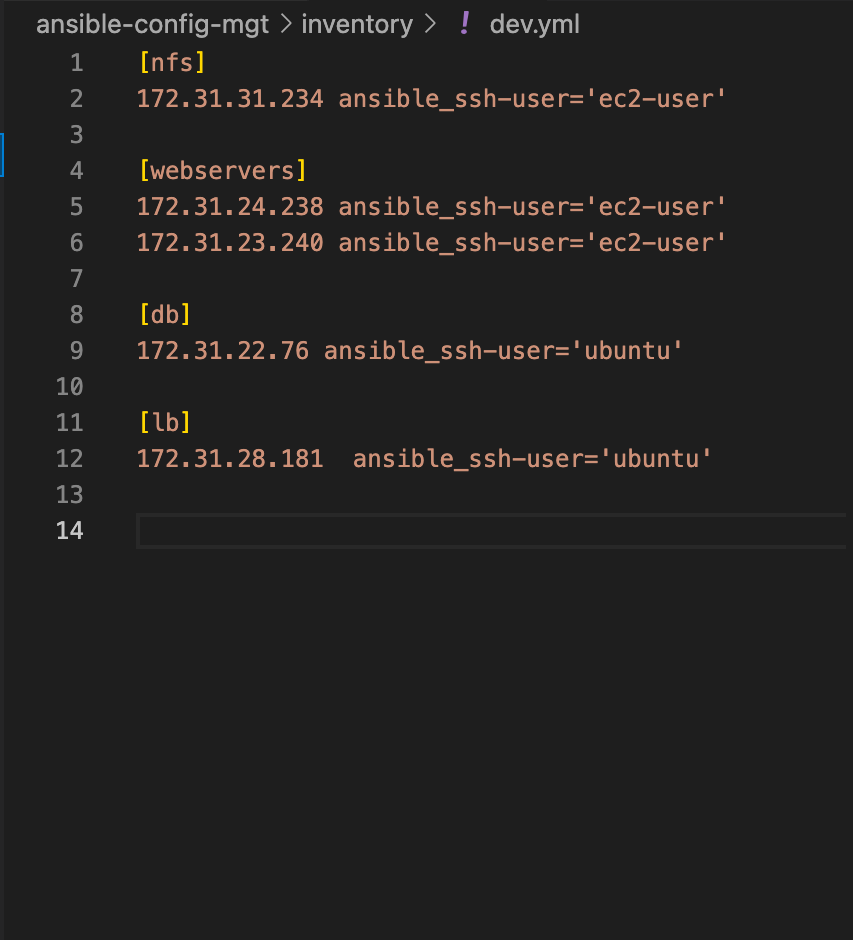


- Updated the path of the inventory, so that ansible knows where to get the inventory file

```
sudo vi /etc/ansible/ansible.cfg
```

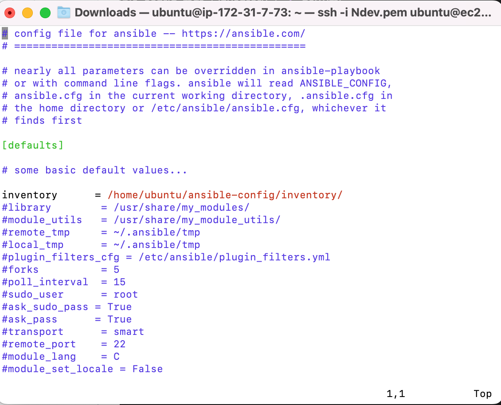


### Setting up SSH agent 

- Ansible uses TCP port 22 by default,which means it needs to ssh into target servers (nfs, db, webservers, lb)

- Adding my key.pem file to ssh agent

from downloads directory  ran
```
eval `ssh-agent -s`
```
```
ssh-add  Ndev.pem
```
```
ssh -A ubuntu@public ip address
```
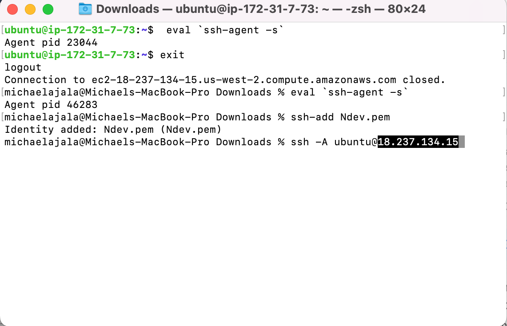

- Persisted the key on the server so every other instances created on the Ndev.pem key can be accessed by the ansible server


- The command below was used to confirm that the key was successfuly added.

```
ssh-add -l
```

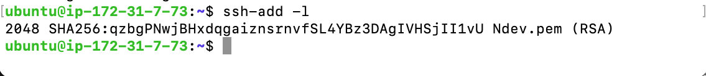

- Configured ssh-agent on vs code with the same process. 

### CREATE A COMMON PLAYBOOK

-  It is time to give Ansible instructions on what needs to be performed on all servers listed in inventory/dev.yml

- Updated the playbook/common.yml file with the following code:

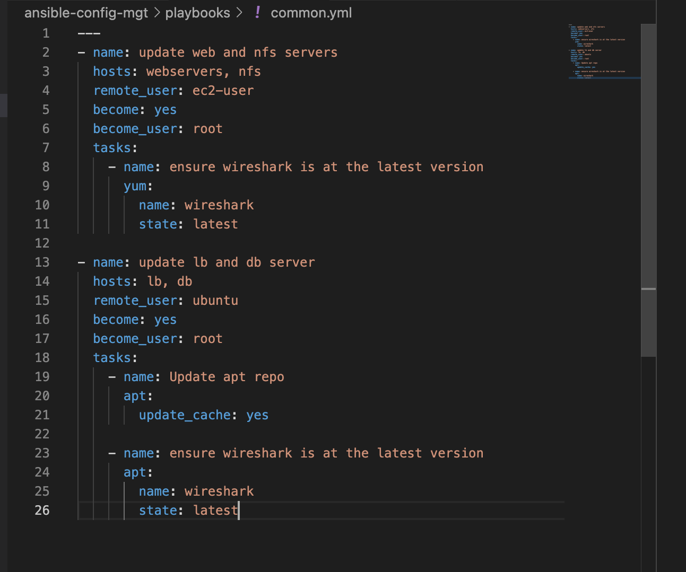


### Updated GITHUB with the latest code
- Used the git  command to add commit and push to GITHUB

```
git add .
git commit -m "commit message"
git push orgin branch name
```

- Created a pull request

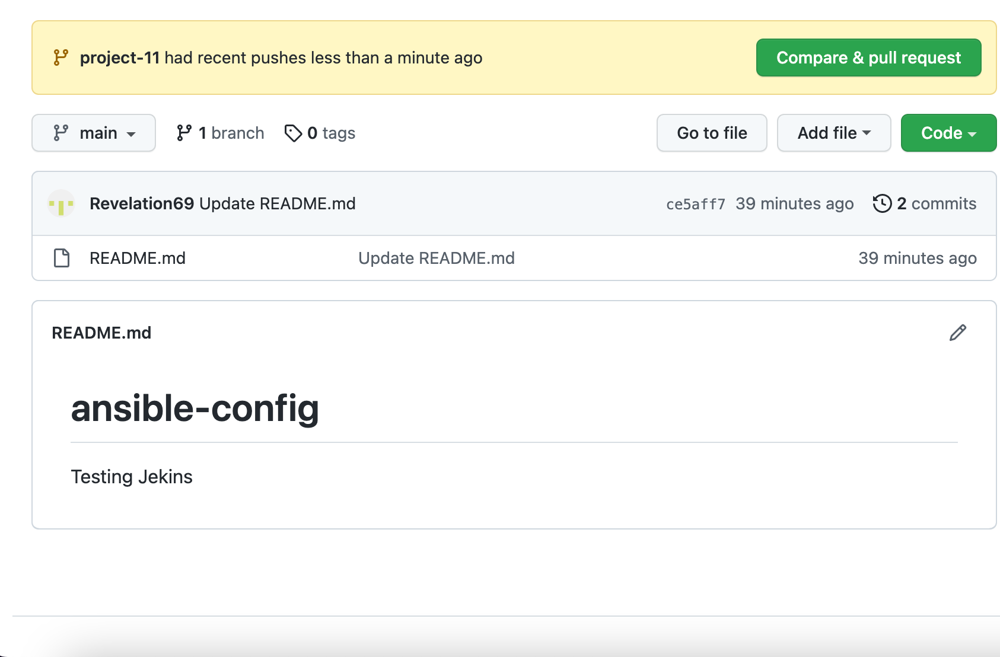

- merged the code to the main branch

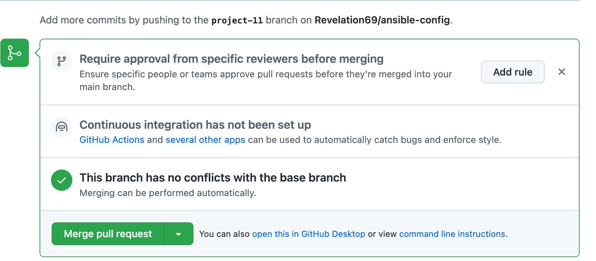


- confirmed build on jekins

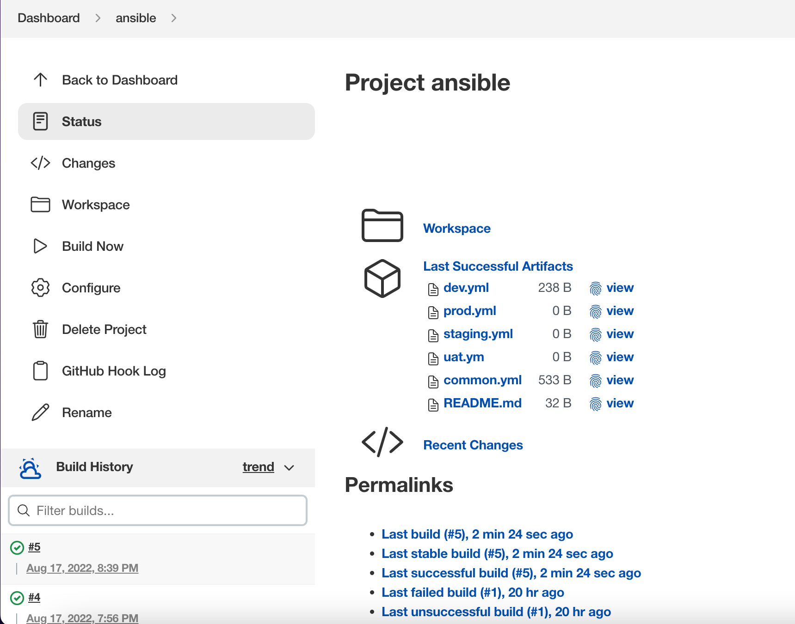

- Checked out from the feature branch into the main, and pulled down the latest changes.

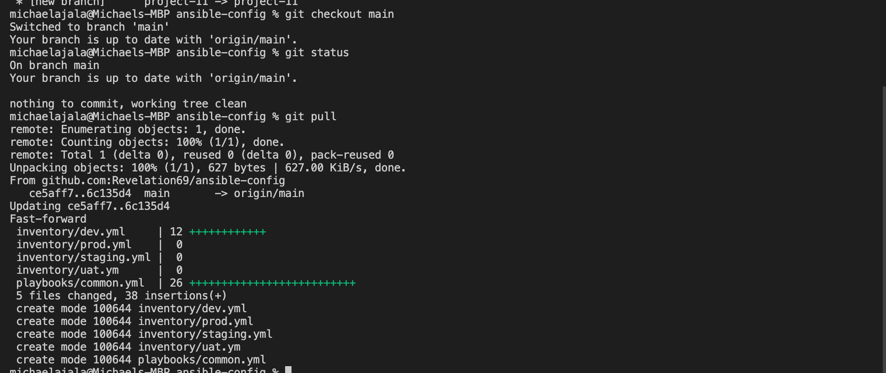

- Executed ansible-playbook command and verified that the playbook actually works:

```
cd ansible

cd ansible-config

ansible-playbook -i inventory/dev.yml playbooks/common.yml
```

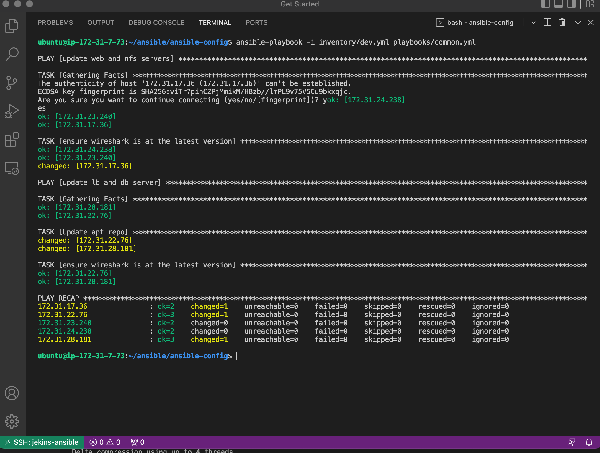